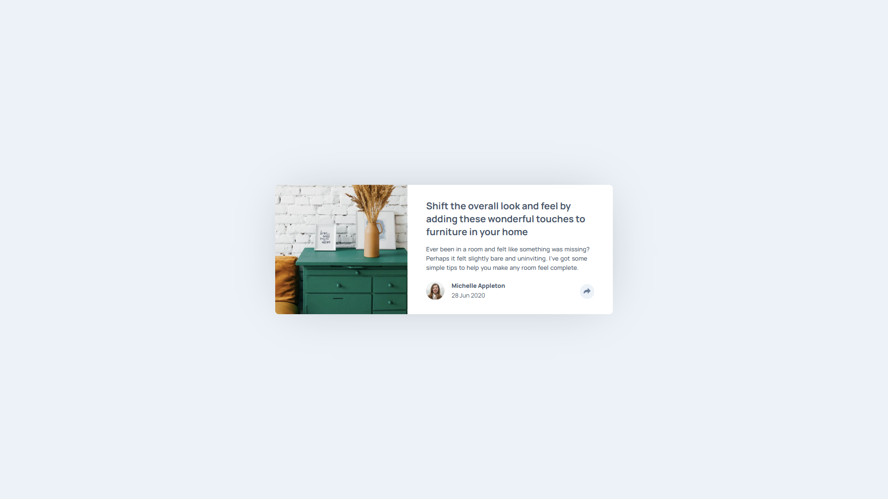
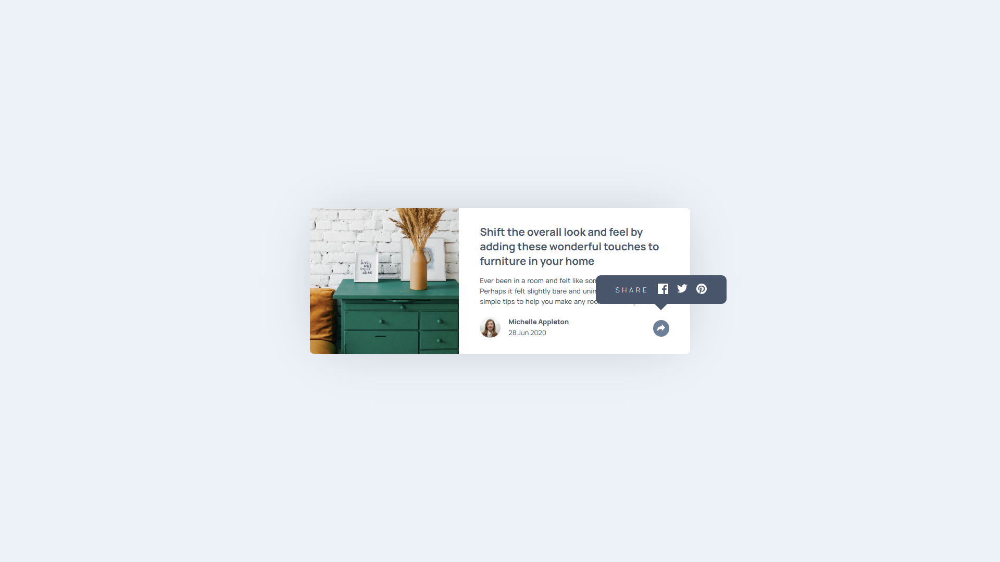
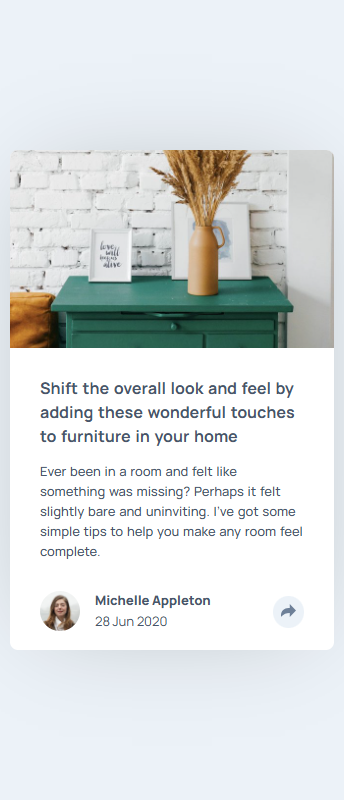
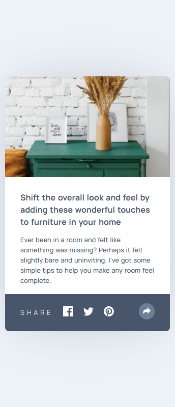

# 📰 Article Preview Component

Projeto de componente visual de **Prévia de Artigo**, desenvolvido como parte de um desafio do **Frontend Mentor**. O objetivo foi criar um cartão de artigo com informações do autor e funcionalidade de compartilhamento, com foco em layout limpo, responsividade e interatividade simples.

---

## 📌 Desafio

Construir um componente funcional com base no layout proposto, contendo:

- Imagem de capa do artigo;
- Título e parágrafo com resumo;
- Foto e dados do autor;
- Botão com ícone de compartilhamento;
- Tooltip com opções de redes sociais (Facebook, Twitter, Pinterest);
- Layout adaptável para dispositivos móveis.

---

## ⚙️ Funcionalidades

- Compartilhamento com exibição dinâmica do menu social;
- Feedback visual no botão ao ativar o menu;
- Layout com responsividade para diferentes larguras de tela;
- Design adaptado com ajustes de espaçamento, tipografia e layout em mobile;
- Animações suaves para ativação do menu de compartilhamento.

---

## 🛠️ Tecnologias Utilizadas

- **HTML5**
- **CSS3**
- **JavaScript (DOM Manipulation)**

---

## 🖼️ Resultados

### 🖥️ Desktop

### 📱 Mobile

---

## 🔗 Veja no GitHub Pages

🔗 [Clique aqui para visualizar o projeto](https://inocenciooo.github.io/article-preview/)
